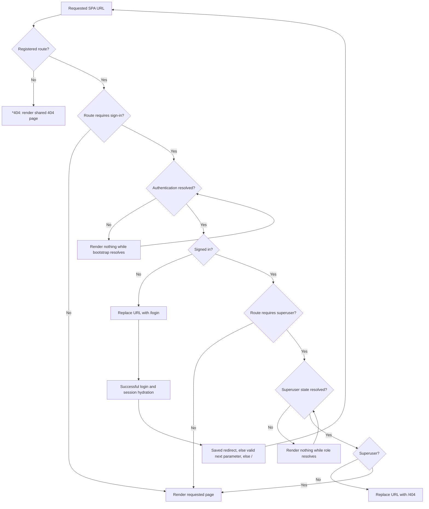

# Page and navigation map

This map covers every registered browser route plus the backend-served and embedded browser surfaces. Mermaid keeps the diagrams reviewable as text and renderable in Markdown viewers with Mermaid support. The route inventory below provides searchable paths and source ownership.

## Page hierarchy

Solid lines show navigation groups and page relationships, not an exhaustive list of clickable links. Dashed lines show embedded or separately served content. Labels mark signed-in and superuser requirements; unmarked SPA routes have no route-level guard. Public page access does not grant permission to mutate its content. All routes remain directly addressable by URL.

```mermaid
flowchart TB
    Site["cyhdev browser application"]
    subgraph Public["Public navigation"]
        Home["/ · Home"]
        AboutGroup["About menu"]
        About["/about · About"]
        AboutBlog["/about-blog · About this site"]
        Stats["/backend-stats · Backend statistics"]
        Blog["/blog · Posts"]
        Post["/blog/:post_id · Post detail"]
        PostNew["/blog/new · New post · signed in"]
        PostEdit["/blog/:post_id/edit · Edit post · signed in"]
        Community["Community menu"]
        Forum["/forum · Topics"]
        Topic["/forum/:topic_id · Topic and replies"]
        TopicNew["/forum/new · New topic · signed in"]
        Notifications["/forum/notifications · Inbox · signed in"]
        Chat["/live-chat · Chat and calls"]
        Visitors["/visitor-board · Visitors"]
        Photos["/photographs · Gallery"]
        Photo["/photographs/:photograph_id · Detail modal"]
        ProjectsGroup["Projects menu"]
        Projects["/projects · WASM projects"]
        Minecraft["/minecraft · Minecraft map page"]
        Geo["/geo-ip-db · IP lookup"]
        EU5["/eu5-locations-db · EU5 Locations DB"]
    end
    subgraph Account["Account and identity pages"]
        Login["/login · Sign in"]
        Register["/register · Sign up"]
        FindPassword["/find-password · Request password reset"]
        ResetPassword["/reset-password · Reset password"]
        VerifyEmail["/verify-email · Confirm email"]
        Profile["/edit-profile · Edit profile · signed in"]
        User["/users/:userName · Public profile"]
    end
    subgraph Admin["Admin workspace · signed in and superuser"]
        Operations["/admin/operations · Default admin page"]
        Authorization["/admin/authorization · Roles and permissions"]
        AdminMinecraft["/admin/minecraft · Server and map controls"]
    end
    subgraph Errors["Fallback pages · shared 404 component"]
        Construction["/under-construction"]
        NotFound["/404"]
        CatchAll["*404 · Unmatched path"]
    end
    subgraph Embedded["Separate browser surfaces · outside SPA routing"]
        Swagger["/swagger-ui/ · API explorer"]
        Map["/minecraft/map/ · Squaremap"]
        EU5App["/eu5-locations-db/app/index.html · Embedded app"]
        WASM["/api/wasm-modules/{wasm_module_id}/wasm · Uploaded demo"]
    end
    Site --> Home & AboutGroup & Blog & Community & Photos & ProjectsGroup
    AboutGroup --> About & AboutBlog & Stats
    Blog --> Post & PostNew
    Post --> PostEdit
    Community --> Forum & Chat & Visitors
    Forum --> Topic & TopicNew & Notifications
    Photos --> Photo
    ProjectsGroup --> Projects & Minecraft & Geo & EU5
    Site --> Login & Profile & User
    Login --> Register & FindPassword
    Register --> VerifyEmail
    FindPassword --> ResetPassword
    Site --> Operations
    Operations --> Authorization & AdminMinecraft
    Site --> Construction & NotFound & CatchAll
    Operations -.-> Swagger
    Minecraft -.-> Map
    EU5 -.-> EU5App
    Projects -.-> WASM
```

The registration-to-verification and password-request-to-reset relationships use emailed links, not direct page redirects. User profiles are reached through user links; they are not a public navigation-menu entry. The admin navigation entry points to `/admin/operations`; there is no registered `/admin` landing route.

## Access and sign-in flow

`RequireAuth` redirects to `/login` without preserving a `next` parameter itself. The login page separately supports a saved redirect and a same-site `next` query parameter. Backend authorization remains authoritative; these guards control page rendering only. Swagger uses backend access control: signed-in superusers in production, unguarded by that middleware in non-production. Its failures are HTTP responses, not the SPA `/404` redirect.

## Complete SPA route inventory

Paths are normalized from nested definitions in [routes.ts](../../../solid-csr-spa-template/src/routes.ts). There are 33 route states: 24 public, five signed-in, three superuser, and one unmatched-path fallback. The gallery's index child and parent represent the same `/photographs` URL. Source paths below are relative to [src/](../../../solid-csr-spa-template/src/).

| URL pattern | Route access | Page source / behavior |
| --- | --- | --- |
| `/` | Public | `pages/home.tsx` |
| `/about` | Public | `pages/about.tsx` |
| `/about-blog` | Public | `pages/about_blog.tsx` |
| `/backend-stats` | Public | `pages/backend_stats.tsx` |
| `/blog` | Public | `pages/posts/List.tsx` |
| `/blog/new` | Signed in | `pages/posts/New.tsx` |
| `/blog/:post_id` | Public | `pages/posts/View.tsx`; links may supply a slug |
| `/blog/:post_id/edit` | Signed in | `pages/posts/Edit.tsx`; write permission still enforced separately |
| `/forum` | Public | `pages/forum/List.tsx` |
| `/forum/new` | Signed in | `pages/forum/New.tsx` |
| `/forum/notifications` | Signed in | `pages/forum/Notifications.tsx` |
| `/forum/:topic_id` | Public | `pages/forum/Topic.tsx` |
| `/live-chat` | Public | `pages/live_chat.tsx`; chat/call actions have their own eligibility |
| `/visitor-board` | Public | `pages/visitor_board.tsx` |
| `/users/:userName` | Public | `pages/user_info.tsx` |
| `/photographs` | Public | `pages/photographs.tsx` |
| `/photographs/:photograph_id` | Public | Same mounted gallery; URL-synced detail modal, null child component |
| `/projects` | Public | `pages/projects.tsx`; demos open in an iframe modal or separately |
| `/minecraft` | Public | `pages/minecraft.tsx`; map iframe |
| `/geo-ip-db` | Public | `pages/geo_ip_info.tsx` |
| `/eu5-locations-db` | Public | `pages/eu5_locations_db.tsx`; embedded EU5 app |
| `/login` | Public | `pages/login.tsx`; password and OIDC entry/return UI |
| `/register` | Public | `pages/signup.tsx` |
| `/find-password` | Public | `pages/find_password.tsx` |
| `/reset-password` | Public | `pages/reset_password.tsx`; emailed fragment token |
| `/verify-email` | Public | `pages/verify_email.tsx`; explicit confirmation of emailed fragment token |
| `/edit-profile` | Signed in | `pages/edit_profile.tsx` |
| `/admin/operations` | Superuser | `pages/admin_operations.tsx` |
| `/admin/authorization` | Superuser | `pages/admin_authorization.tsx` |
| `/admin/minecraft` | Superuser | `pages/admin_minecraft.tsx` |
| `/under-construction` | Public | `errors/404.tsx` |
| `/404` | Public | `errors/404.tsx` |
| `*404` | Fallback | `errors/404.tsx`; router catch-all pattern, not a literal URL |

## Embedded content and non-page states

| Surface | Owner and behavior |
| --- | --- |
| `/swagger-ui/` | [Backend Swagger router](../../../rust-be-template/src/routers/swagger.rs); links to `/api-docs/openapi.json`, which is schema data, not a page |
| `/minecraft/map/` | [Squaremap router](../../../rust-be-template/src/routers/main_router/squaremap.rs); `/minecraft/map` redirects here; serves the configured public map directory or an unavailable response |
| `/eu5-locations-db/app/index.html` | [EU5 host source](../../../vendor/eu5-location-filter/web/index.html), staged by [xtask](../../../tools/xtask/src/eu5_web.rs); availability depends on staged/embedded assets |
| `/api/wasm-modules/{wasm_module_id}/wasm` | [Bundle serving](../../../rust-be-template/src/features/wasm/api/serve_bundle.rs); project records provide the link, so demo instances are data-driven rather than fixed SPA routes |

`/admin/operations#retention-notifications`, `#media-cleanup`, `#i18n-sync`, and `#hard-purge` are sections within the operations page. Forum reply fragments, blog search parameters, photograph overlays, project upload/edit dialogs, and call controls are page states, not additional routes. The OIDC callback at `/api/auth/oidc/callback` is a backend protocol endpoint, not a separate frontend page. Local WASM demo host files belong to development/demo artifacts, not extra registered website routes.

## Maintaining this map

When adding, removing, renaming, or guarding a route, update the diagram and inventory in the same change. Also update embedded surfaces when their mounting or access changes. Keep the public menu structure aligned with [PublicNavigation.tsx](../../../solid-csr-spa-template/src/components/PublicNavigation.tsx), admin links with [admin/navigation.ts](../../../solid-csr-spa-template/src/components/admin/navigation.ts), and access flow with [RequireAuth.tsx](../../../solid-csr-spa-template/src/components/RequireAuth.tsx), [RequireSuperuser.tsx](../../../solid-csr-spa-template/src/components/RequireSuperuser.tsx), and [login.tsx](../../../solid-csr-spa-template/src/pages/login.tsx). Source code is authoritative if this document drifts.
