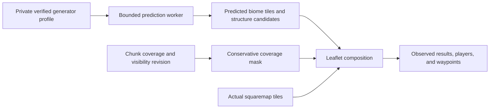

# Minecraft seed-map blending exploration

- Status: complete, 2026-09-28, for feasibility research and a bounded compatibility experiment. No prediction feature is implemented or enabled.
- Checkout: `main`, preceding research commit `bca55c9`; seven local commits ahead of fetched `origin/main`, with no remote divergence before this documentation update.
- Completed: reviewed the query contracts, squaremap projection, coverage, compositing, and provenance; compared a maintained 26.3 Cubiomes fork with saved Minecraft data; inspected Pumpkin and other Rust alternatives. Cubiomes fails the exact-biome gate. Paper is the shortest integration path; Pumpkin is the strongest reviewed native Rust candidate for 26.3.
- Verification: primary-source and installed-API inspection; pinned Cubiomes Debug build and five upstream tests pass; independent comparison finds 179 mismatches across 75,264 saved quart-biome samples. Pumpkin and other Rust alternatives received source review only, without builds or local benchmarks. No production seed, world files, or services were accessed, and no new terrain was generated.
- Remaining: no research work remains. Implement bounded Paper sampling for the quickest preview, or first test a pinned Pumpkin adapter against the same fixture if Rust ownership is preferred. Production prediction, structure validation, and Apple Silicon runtime verification remain future work; they are not prerequisites for completing this exploration.

## Recommendation

The subsequent [biome prediction implementation](2026-09-28-minecraft-seed-predictions.md) adopts the pinned Pumpkin adapter, a 512 MiB RAM cache, effective large-biomes detection, and conservative coverage blending. Its independent fixtures identify biome-tree ties and document the preview as approximate; the source-only conclusions below remain the research record.

Seed-map blending is feasible within the current Solid/Leaflet interface. Add a separately labeled prediction layer for unexplored areas, with actual generated terrain taking precedence. For the quickest implementation, extend the existing Paper bridge with its batched exact-version biome resolver for a bounded fixed-Y preview. For a native Rust implementation, test Pumpkin's public biome sampler before extracting or porting generation code. No comparable runtime benchmark establishes the fastest engine for this map. Retain observed block search and surface elevation as actual-world features. Add predicted structures only after independent placement and viability validation.

The maintained `xpple/cubiomes` fork is a useful approximate candidate, but the local experiment found 179 disagreements with saved 26.3 biome data. It must not be described as an exact predictor. Its noise precision differs from the release notes; whether that explains the observed disagreements remains unproven. Matching the version label and passing the fork's regression tests are insufficient compatibility evidence.

| Option | Evidence and fit | Decision |
| --- | --- | --- |
| Original `Cubitect/cubiomes` | The earlier upstream inspection found no explicit 26.3 implementation. | Do not use an older generator under a new label. |
| `xpple/cubiomes`, pinned to `18edd56575a60fe7129705bf972de0a511437527` | Active MIT-licensed fork with 26.3 biome tables, dappled forests, abandoned-camp placement and fixtures. Local saved-biome comparison has 179 mismatches; precision and Apple Silicon build concerns remain. | Fails the exactness gate. Consider only as an explicitly approximate option, or re-evaluate after a verified fix. |
| Conflux's Cubiomes fork and map integration | Incorporates the maintained fork and provides native/browser integration examples. Its pinned manifest records 26.3 support, but documented reference comparisons stop at 26.2, with 26.3 smoke checks. | Useful integration reference; no stronger proof of 26.3 accuracy. Review the MIT core separately from the GPL-licensed integration shims. |
| Exact Paper/Minecraft generator | Installed 26.3 bytecode exposes an uncached biome resolver and base-height sampling without full chunk generation. It shares effective registries with Minecraft but depends on unstable server internals. | Preferred next biome-preview prototype and validation reference; keep expensive work outside the live server tick. Runtime integration is not yet verified. |
| Pumpkin `pumpkin-world`, pinned to `4426d1113a211e6018a2db416e33b6b8a7802614` | Public Rust biome sampler, volume batching, explicit 26.3 noise port, current biome tables, and upstream fixture-parity reports. GPL-3.0; several workspace dependencies. | Preferred Rust experiment. Validate against saved Paper biomes before adoption; no local parity or speed result yet. |
| Separate generated reference world | Can produce actual pristine blocks using matching server code and configuration, but requires chunk generation, storage, and rendering. Generation near old-world boundaries can still differ. | Too much work and storage for the first biome/structure layer; reserve for a future pristine-terrain preview. |

## Rust generator candidates

The follow-up source review changes the native-generator shortlist: Pumpkin has a merged 26.3 precision port and is a stronger candidate than assuming the inspected Cubiomes fork is the only practical option. Its pinned workspace declares `0.2.0+26.3-26.51` and Rust 1.96. `pumpkin-world` is a library that can sample biomes without a server, level, loaded chunks, or world directory. It pulls the data, utility, configuration, NBT, and codec crates plus runtime/compression dependencies; it is broader than a small seed library, but does not require the server executable. Start with a pinned adapter rather than copying interconnected noise, random-number, router, and generated biome modules. See the [workspace metadata](https://github.com/Pumpkin-MC/Pumpkin/blob/4426d1113a211e6018a2db416e33b6b8a7802614/Cargo.toml) and [library dependencies](https://github.com/Pumpkin-MC/Pumpkin/blob/4426d1113a211e6018a2db416e33b6b8a7802614/crates/pumpkin-world/Cargo.toml).

The public sampling path is `GlobalRandomConfig::new(seed, false)` → `ProtoNoiseRouters::generate(&OVERWORLD_BASE_NOISE_ROUTER, &random_config)` → `MultiNoiseSampler::generate(&routers.multi_noise)` → optional bounded `fill_volume(...)` → `MultiNoiseBiomeSupplier::OVERWORLD.biome(quart_x, quart_y, quart_z, &mut sampler)`. Retain initialized routers and use mutable samplers per worker. The default constructor also prepares terrain and surface routers; the public biome-router fields allow a narrower initialization after the baseline works. These are inspected APIs, not a compiled integration example. Sources: [router construction](https://github.com/Pumpkin-MC/Pumpkin/blob/4426d1113a211e6018a2db416e33b6b8a7802614/crates/pumpkin-world/src/generation/noise/router/proto_noise_router.rs), [batch sampler](https://github.com/Pumpkin-MC/Pumpkin/blob/4426d1113a211e6018a2db416e33b6b8a7802614/crates/pumpkin-world/src/generation/noise/router/multi_noise_sampler.rs), and [biome supplier](https://github.com/Pumpkin-MC/Pumpkin/blob/4426d1113a211e6018a2db416e33b6b8a7802614/crates/pumpkin-world/src/biome/mod.rs).

Pumpkin's merged [26.3 noise port](https://github.com/Pumpkin-MC/Pumpkin/pull/3213) uses float-valued synthesis and batched density volumes. Its author reports matching a newly extracted 26.3 multi-noise fixture, with biome-stage time improving from 1.09 ms to 0.72 ms on the same machine. These upstream measurements do not establish current map-tile latency or superiority over Paper or Cubiomes. Current generated biome tables include [dappled forest and sulfur caves](https://github.com/Pumpkin-MC/Pumpkin/blob/4426d1113a211e6018a2db416e33b6b8a7802614/crates/pumpkin-data/src/generated/biome.rs). Full terrain and structures need separate verification: current [chunk parity helpers tolerate mismatched blocks](https://github.com/Pumpkin-MC/Pumpkin/blob/4426d1113a211e6018a2db416e33b6b8a7802614/crates/pumpkin-world/src/generation/proto_chunk_test.rs), and an [open mineshaft report](https://github.com/Pumpkin-MC/Pumpkin/issues/3749) describes a 26.3 discrepancy. Neither has been independently reproduced here.

Pumpkin generation code is [GPL-3.0](https://github.com/Pumpkin-MC/Pumpkin/blob/4426d1113a211e6018a2db416e33b6b8a7802614/LICENSE); its plugin API's permissive license does not cover these modules. This repository's root license is MIT. Reusing or extracting the generator must preserve its license and applicable distribution obligations. Extracted assets also have [separate notices](https://github.com/Pumpkin-MC/Pumpkin/blob/4426d1113a211e6018a2db416e33b6b8a7802614/assets/NOTICE.md).

| Other Rust option | Reviewed limitation for this 26.3 map |
| --- | --- |
| [cubiomes-rs](https://github.com/villevilli/cubiomes-rs/tree/71e50599d77e6000a52323c0cb275e4d4a38682d) | MIT Rust bindings to C, not a native Rust generator. Its pinned C version predates 26.3; updating the wrapper's C dependency would still require parity validation. |
| [minecraft_seed_core](https://github.com/TinggalLeaf/minecraft_seed_core/blob/9289d9e79e693f77f726d54400d47b0611d453e3/src/version.rs) | Small MIT native Rust library, but the Java version enum ends at 1.21.4. Bedrock 26.x support does not establish Java 26.3 compatibility. |
| [SteelMC / steel-worldgen](https://github.com/Steel-Foundation/SteelMC/tree/27122d81bc13a68b68f38917c19873ecad4869ca) | Native Rust with SIMD and a standalone biome API; current package targets 26.2, requires nightly Rust, and is AGPL-3.0-or-later. A 26.3 port is needed before comparison. |
| [Ferrite](https://github.com/VoiceLessQ/Ferrite/tree/843a14a36b54f55ec175ecf4b89f8a118a7dba90) | MIT Rust modules in a Fabric/JNI mod with a 26.3 release. Its reviewed biome validation checks classification of Java-sampled climate values; Java exports generation state. Useful reference code, not demonstrated standalone seed-to-biome parity. |

SteelMC's [published 18.8× throughput result](https://steelmc.dev/reference/benchmarks/) compares full chunks against Fabric, using 30.2 CPU cores versus 4.4, and excludes Steel's entity spawning. Its reported normalization is 2.75× per CPU-second. Those first-party results are not fixed-Y biome benchmarks or comparisons with Pumpkin/Cubiomes; Apple Silicon performance is unmeasured here.

For Pumpkin, the first acceptance experiment should compare its scalar and batch outputs against the retained 75,264-point Paper fixture, especially quart `(48,-3,29)`, then expand signed seeds, negative coordinates, cave heights, and new biomes. Only after correctness passes should identical bounded map workloads compare cold initialization, warm latency, allocations, and concurrency on the deployment CPU. No Pumpkin build or local runtime comparison was performed in this review.

## Research notes

Minecraft 26.3 adds dappled forests and abandoned camps and changes density-function and noise evaluation to single precision. Minecraft 26.2 adds sulfur caves and sulfur springs. Consequently, an older generator with a renamed version selector cannot establish current compatibility. The original Cubiomes upstream reviewed during the explorer implementation lacks explicit 26.3 support, but an actively maintained fork now warrants evaluation.

The fork's 26.3 changes are substantive, including new biome decision tables and abandoned-camp placement rules. However, the inspected biome noise path still uses double-valued coordinate warps and `sampleDoublePerlin`, and terrain helpers retain double-valued calculations without a 26.3-specific precision path. This differs from the official precision change and makes broad exactness unproven. The CMake build also applies `-mpopcnt` unconditionally; an Apple Silicon build needs an architecture guard or a narrower reviewed build adapter. Neither issue is resolved merely by pinning the revision. Its terrain viability check uses an approximate climate-depth threshold, and [an open issue reports false-positive structures where sulfur caves reach the surface](https://github.com/xpple/cubiomes/issues/19); that report is a validation case, not a locally reproduced result.

Squaremap image alpha is not an unexplored-area indicator: genuinely empty columns can be transparent, and images can also contain unwritten pixels. Missing tiles indicate unavailable renders, which can include generated but unrendered areas. Predictions therefore need independent chunk-generation coverage and visibility rules before compositing. Unknown or stale coverage must not be interpreted as unexplored terrain.

Installed Paper 26.3 build 28 contains the new biome/structure identifiers and float-valued density-function operators. `BiomeSource.createUncachedResolver(RandomState)` provides a potential exact-version biome reference. `NoiseBasedChunkGenerator.getBaseHeight` returns the first free Y from base noise and aquifers using an empty blending context; it excludes final surface/features, structures, and player modifications. It must not be labeled current surface elevation. Public structure-location calls can request structure-start chunks, so production `locate` calls are unsuitable for non-generating previews.

## Composition and coverage

| Coverage state | Visible result |
| --- | --- |
| Generated and rendered | Actual squaremap terrain, including genuine transparency. |
| Generated but not rendered, or tile unavailable | Last verified actual tile or neutral “not rendered” coverage; no prediction. |
| Confirmed ungenerated, permitted, supported configuration | Hatched or muted prediction, explicitly labeled. |
| Unknown, excluded, stale coverage, or unsupported prediction configuration | Suppress prediction. Preserve any permitted, verified actual tile; otherwise show neutral coverage. |

Suppress predictions for every generated chunk. This protects player edits without maintaining an unreliable edit detector. Saved region slots alone are insufficient because partially generated chunks also occupy slots; inspect bounded chunk status metadata and include generated-but-unsaved chunks known to the live server. Partial generation, unreadable files, concurrent writes, and incomplete inventories remain unknown. The existing query's aggregate `missing_chunks` count cannot serve as a spatial coverage mask.

Retain the current projection: `lat = -z / 2^maxZoom`, `lng = x / 2^maxZoom`, with 512-pixel tiles. A tile at zoom `q` covers `512 × 2^(maxZoom-q)` blocks on each axis. Prediction tiles and coverage masks use that same grid and floor division at negative coordinates. Coarse masks suppress a predicted pixel whenever any part of its footprint is generated, excluded, or unknown; averaging the mask would reveal predictions over narrow edited areas.



Introduce a world-instance identity that changes when a world is reset, plus separate generator and coverage revisions. Generation must invalidate prediction eligibility before the next published coverage revision; a connected map suppresses affected predictions while coverage is revalidated, then displays actual tiles when available. Rendering failure never restores predictions. A polling design has a bounded stale interval and must report its observation time; it cannot promise instantaneous handoff. Stale or disconnected coverage suppresses predictions. Avoid claiming atomic world-wide snapshots from independent PNG refreshes.

## Generator configuration and ownership

Keep seed material on the server. The browser receives an opaque profile identifier, prediction provenance, colors, and markers. Run prediction behind the existing Minecraft service boundary with bounded CPU concurrency, queue depth, tile/sample count, response size, and cache bytes/entries. Cancel obsolete viewport work, coalesce identical jobs, and surface saturation. Predictions must not enter the existing actual-world `cells`, `structures`, or `matches` collections without a distinct source type.

For the preferred Paper prototype, capture generator/registry references on the server thread through a pinned adapter and evaluate on a bounded worker, rejecting custom generator/provider callbacks initially. Installed bytecode exposes `MultiNoiseBiomeSource.createResolverForChunk(...)` for a rectangular quart volume despite its chunk-specific name. Create a request-local `Climate.Sampler` and mutable context; share only the underlying supported generator state. At the existing eight-by-eight-chunk bound, a fixed-Y batch is 32 × 1 × 32 samples, with six climate float arrays totaling 24 KiB before intermediates and response allocation. Broad low-zoom queries need coarser scalar samples under the same point budget rather than dense viewport volumes. Start with at most 1,024 samples, one worker, a fixed deadline, and no persistent prediction cache. Verify batch/scalar parity, allocations, and tick impact before enabling the adapter. Do not create a Bukkit preview world or call chunk loading or structure-location APIs to service a prediction. Automatic viewport rendering follows only after bounded runtime measurements and generation-coverage invalidation work correctly.

If the native fork is retained later, its C API contains process-exit paths and unchecked allocations. `Generator` has pointers into its own storage; structure checks mutate it, and a global structure-configuration provider affects every world. Prefer a bounded Rust worker executable in this workspace, with an opaque stable-address C handle per active generator, serial access, checked bulk buffers, and a parent-enforced deadline/restart policy. Avoid sharing a generator concurrently or swapping the global provider per request. The single-point API allocates a cache repeatedly; use validated bulk generation for tile-sized requests. This isolates C failures from the website process and permits terminating expired CPU work.

A supported profile needs the exact generator revision, edition, dimension, seed identity, world preset and generator settings, effective world-generation datapack content, experimental flags, and relevant Paper/Spigot structure salts or feature seeds. Default presets must be positively identified. Custom generators or unsupported salts disable affected predictions, rather than silently using vanilla defaults. Public world names are not stable cache identities. Hashes and raw seeds remain private; public identifiers should be opaque. Keeping the seed out of browser requests avoids direct disclosure, but published biome and structure predictions are not a guarantee against seed inference.

The installed 26.3 fixture stores generation settings per dimension under `world/dimensions/minecraft/<dimension>/data/minecraft/world_gen_settings.dat`. These settings include seed/options and dimension generator codecs. The world save also records version information, enabled packs, and version history. Pack names alone do not fingerprint effective registry content. Chunk `DataVersion` records serialization format, not necessarily the version that originally generated the terrain. Existing chunks always remain authoritative; predictions describe what the selected supported generator would produce in untouched areas, with old-chunk transition behavior an explicit limitation.

## First implementation slice

1. Build a pinned Paper resolver adapter for the quickest delivery, or a pinned Pumpkin adapter if native Rust ownership is preferred. Reuse the retained synthetic fixture, check scalar/batch parity against saved exact-version biomes, and measure bounded execution. Paper requests must demonstrate no chunk loads or generation. Expand coverage to new 26.3 cases and reject unsupported generation profiles before selecting an engine. Pumpkin's upstream reports do not replace these local acceptance checks.
2. Add bounded, revisioned coverage metadata that distinguishes full chunks, partial/unknown chunks, confirmed absence, and visibility exclusions. Preserve current actual-world protocol behavior and regenerate HTTP contracts when new endpoints/types are added.
3. Add an optional “Predicted unexplored biomes” layer in the existing Layers panel. Start with an explicitly labeled fixed-Y slice; do not imply that it matches the existing highest-non-air surface sample. Surface-aware predictions require separate height validation. Show a persistent prediction legend and selected-location source/version.
4. Add candidate structure markers after placement and terrain-viability checks. Keep candidates visually distinct from saved structure starts and retire them once their area is generated. Keep current block search entirely observational.

The acceptance suite must cover negative coordinates and tile seams, genuine empty terrain, End void, hidden/excluded regions, generated-but-unsaved chunks, failed PNG loads, stale coverage, world resets, mixed save histories, and dimension switches with pending work. Generator checks need multiple signed 64-bit seeds, cave and surface Y levels, new 26.3 features, and every enabled dimension. A small seed-1 parity sample supports feasibility but does not certify all of these cases. Development measurements should determine tile resolution and worker/cache limits; no throughput claim is made from a Debug build.

## Observed verification

The unmodified pinned Cubiomes fork builds in Debug mode with GCC, `-O0`, `-g3`, and `-fwrapv`; its five CTest executables pass. Their coverage is limited: the structure test targets 1.16.5, piece/carver tests target 1.21.11, and dedicated 26.3 coverage includes a dappled-forest sample and abandoned-camp loot. Passing these executables does not establish complete 26.3 placement or terrain parity.

The stopped disposable Paper 26.3 build 28 fixture, created during the prior explorer implementation with synthetic seed `1`, supplies independent saved biome palettes. The first comparison covers all 1,536 quart-biome cells in its sole fully generated chunk `(10,10)` and has zero mismatches. Every cell is forest, making this a plumbing check rather than meaningful boundary coverage.

The broader comparison covers 49 already-saved chunks and 75,264 quart-biome cells: 24 chunks at BIOMES status, 16 at TERRAIN, eight at INITIALIZE_LIGHT, and one FULL; 480 STRUCTURE_STARTS chunks were excluded because they lack completed biome data. The sample contains beach, forest, ocean, river, and stony shore, with quart X/Z 28–55 and quart Y -16–79. Negative Y is covered; negative X/Z, other dimensions, cave biomes, and the new 26.3 biome are not covered by this fixture.

The unmodified fork's `MC_26_3` mode disagrees on 179 of those 75,264 samples. These disagreements occur in two quart X/Z columns: `(44,37)` at 96 heights and `(48,29)` at 83 heights, all predicted as beach where the saved biome is stony shore. For example, quart `(48,-3,29)`, whose block origin is `(192,-12,116)`, is saved as `stony_shore` but predicted as `beach`. The mismatch is sufficient to fail exact compatibility for the inspected revision; it does not identify the root cause or establish the error rate across arbitrary worlds. Partial-generation chunks here are used only as a source of completed raw biome palettes, never as proof of rendered/full terrain for the coverage mask.

The first mismatch was independently re-decoded using the installed Paper runtime: chunk `(12,7)`, status `minecraft:biomes`, `DataVersion=5023`, section Y `-1`, palette `[river, beach, stony_shore, forest]`, two bits per entry, storage index `20`, and palette index `2`. This confirms the saved value is stony shore and excludes a coordinate-order or packed-palette decoding error for that sample. It does not prove the precision change caused the discrepancy.

Local evidence: `/tmp/cyhdev-cubiomes-research-263` contains the pinned source and Debug build; `build-debug/Testing/Temporary/LastTest.log` records the five passing tests. `/tmp/cyhdev-seed1-quart-biomes.tsv` contains the full-chunk baseline. `/tmp/cyhdev-seed1-generated-biomes.tsv` contains the broader four-column `quart_x`, `quart_y`, `quart_z`, `biome` fixture, SHA-256 `15d31fb68f507f41fce02799b36ed64af49b1802c7c45db45f299a6ea0ccc5d0`. Data came from the stopped synthetic fixture `/tmp/cyhdev-map-isolated-vfFNOHO9`; no server was started for this exploration.

Extraction used JShell with the installed Paper/server library classpath, JDK zlib, bounded `NbtIo.read`, and `SimpleBitStorage`. The packed index is `(localQuartY << 2 | localQuartZ) << 2 | localQuartX`. The first discrepancy can be inspected in region `r.0.0.mca`, header slot `236`, byte offset `200704`, compressed length `410`, section `-1`, storage index `20`. No application tests or builds were rerun because only research documentation changed. No release build or macOS runtime test was run.

The probe source, broader input, mismatch rows, result summary, and CTest log are also copied under ignored `target/minecraft-seed-research/`. The local experiment can be repeated with the retained research checkout and fixtures:

```bash
cd /tmp/cyhdev-cubiomes-research-263
git rev-parse HEAD
cmake -S . -B build-debug -DCMAKE_BUILD_TYPE=Debug -DCMAKE_C_FLAGS=-fwrapv
cmake --build build-debug -j4
ctest --test-dir build-debug --output-on-failure --timeout 60
gcc -O0 -g3 -fwrapv -Wall -Wextra -I. /tmp/cyhdev-cubiomes-parity.c \
  -o /tmp/cyhdev-cubiomes-parity -Lbuild-debug \
  -Wl,-rpath,/tmp/cyhdev-cubiomes-research-263/build-debug -lcubiomes -lm
/tmp/cyhdev-cubiomes-parity < /tmp/cyhdev-seed1-generated-biomes.tsv \
  > /tmp/cyhdev-cubiomes-mismatches.tsv 2> /tmp/cyhdev-cubiomes-parity-result.txt
```

The comparison intentionally exits with status `1` when mismatches are found. The probe source SHA-256 is `212362c81e9fdea47867bd9f5cf4d0a0acfbc749c66ca45aceb964c4458f5662`; mismatch rows SHA-256 is `74804f9103fedab61bf5c2cf49bf5b0804f5eba025714c4c737d64124f7673fe`.

## Sources

Primary sources consulted on 2026-09-28:

- [Minecraft 26.3 release notes](https://www.minecraft.net/en-us/article/minecraft-java-edition-26-3).
- [Minecraft 26.2 release notes](https://www.minecraft.net/en-us/article/minecraft-java-edition-26-2).
- [Maintained Cubiomes fork at the inspected revision](https://github.com/xpple/cubiomes/tree/18edd56575a60fe7129705bf972de0a511437527).
- [Fork biome noise implementation](https://github.com/xpple/cubiomes/blob/18edd56575a60fe7129705bf972de0a511437527/biomenoise.c), [build configuration](https://github.com/xpple/cubiomes/blob/18edd56575a60fe7129705bf972de0a511437527/CMakeLists.txt), and [MIT license](https://github.com/xpple/cubiomes/blob/18edd56575a60fe7129705bf972de0a511437527/LICENSE).
- [Conflux's pinned generator manifest](https://github.com/Conflux-Union/conflux-map/blob/153c50d0e0055fa61bc5ca05b8fb4c2c196aa4e9/native/CUBIOMES_COMMIT) and [native integration notes](https://github.com/Conflux-Union/conflux-map/blob/153c50d0e0055fa61bc5ca05b8fb4c2c196aa4e9/native/README.md).
- [Paper internals development](https://docs.papermc.io/paper/dev/userdev/) and [WorldCreator API](https://jd.papermc.io/paper/26.3/org/bukkit/WorldCreator.html).
- [Squaremap render scanning at the installed revision](https://github.com/jpenilla/squaremap/blob/ac71dd2/common/src/main/java/xyz/jpenilla/squaremap/common/task/render/AbstractRender.java).
- [Squaremap image handling at the installed revision](https://github.com/jpenilla/squaremap/blob/ac71dd2/common/src/main/java/xyz/jpenilla/squaremap/common/data/Image.java).

The deployment and existing actual-world behavior remain documented in the [terrain explorer plan](2026-09-28-minecraft-explorer.md).
